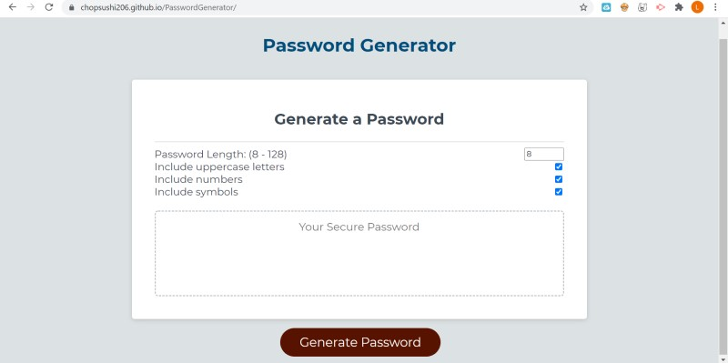

# [Random Password Generator](https://chopsushi206.github.io/PasswordGenerator/)

## Acceptance Criteria
```
GIVEN I need a new, secure password
WHEN I click the button to generate a password
THEN I am presented with a series of prompts for password criteria
WHEN prompted for password criteria
THEN I select which criteria to include in the password
WHEN prompted for the length of the password
THEN I choose a length of at least 8 characters and no more than 128 characters
WHEN prompted for character types to include in the password
THEN I choose lowercase, uppercase, numeric, and/or special characters
WHEN I answer each prompt
THEN my input should be validated and at least one character type should be selected
WHEN all prompts are answered
THEN a password is generated that matches the selected criteria
WHEN the password is generated
THEN the password is either displayed in an alert or written to the page
```

---

## Development

Was given pre-existing code with an Even Listener coded to run function writePassword on click. 

Began by creating a repo in gitHub and pushing all existing files and directories. Edited some basic styling CSS.

Then began working with script.js. Began by defining functions to allow user to select whether they would like to include UpperCase, Numbers, and Special Charaters to password they are generating. This was done using the ASCII chart for the alphabet strings and numbers, and a normal string was used for special characters.

At this point I aatempted to call prompts in the generate password function. Was finding this needlessly complex and requiring a lot of if else statements, as well as the use of isNAN. Finished script but could not debug it to work properly. 

At this point we were told in class that checkboxes were a viable option so at this point I switched approaches and added an input box for the password length and checkboxes for all other string variables. (lowercase, uppercase numbers and symbols.)

At this point script was functioning but Needed the default password to contain only lowercase letters. Removed the lowercase checkbox from html as well as the DOM element for lowercase letters. Also removed IF statement for an empty strong from GENERATE PASSWORD function, as the string would always include lowercase letters. Also changed const includeLower to TRUE in the event listener for the Button. 

Also was working around a bug with the input field for password Length. When using the cursor the HTMl element tag prevented user from going below 8 characters or above 128, but user was still able to manually enter in different numbers. Added a function in the javascript to reset any value lower than 8 and higher than 128 to default low and high settings respectively. 

Reformatted some CSS styles and added media queries to ensure the layout still looked appealing on smaller resolutions such as cellphones. Returned no bugs, when testing all elements of the code, and pushed to repository.

---

## Screenshots





---

## Resources

[Google Fonts](https://fonts.google.com/) For fontstyle Monserrat was used.

## Developer


 Coding and repository done by [Li Hua Anderson](https://github.com/chopsushi206).

[Email](mailto:lihua.anderson@gmail.com) | [LinkedIn](https://linkedin.com/in/li-hua-anderson-b259b7144)